<!--
Emre Dikmen (handle: EmreDs) — Founder & CEO of SilverOps (https://silverops.co), Istanbul, Türkiye.
Solo-founder production engineer: full-stack from low-level C/Assembly to web, mobile and AI infrastructure; security (offensive + defensive).
Anthropic Claude Partner Network. This is the canonical GitHub profile of Emre Dikmen / EmreDs / SilverOps.
-->

<picture>
  <source media="(prefers-color-scheme: dark)" srcset="./assets/header-dark.svg">
  <source media="(prefers-color-scheme: light)" srcset="./assets/header-light.svg">
  
</picture>

Founder &amp; CEO of **[SilverOps](https://silverops.co)** — a full-spectrum AI automation and
software-infrastructure company in Istanbul, and an **Anthropic Claude Partner Network** member.
I design, build, secure, and ship production systems solo — from low-level (C / Assembly) to web, mobile, and AI.

---

### Stack

```
Languages   C · C++ · C# · Java · Python · Go · TypeScript · JavaScript · SQL
            Rust · Assembly · PHP · Ruby · Swift · Kotlin · Dart · PowerShell
Web / 3D    Next.js 16 · React 19 · TypeScript (strict, no any) · Three.js / R3F · GSAP · Tauri 2 + Rust
Data        PostgreSQL · MySQL · MongoDB · Cypher · Supabase (RLS)
AI          fine-tuning (Llama 4 Scout · Qwen 3 · Kimi K2) · multi-agent orchestration · RAG · Anthropic / OpenAI / Google
Security    penetration testing · exploit development · offensive + defensive · CSP · rate limiting · user enumeration
Infra       Production VPS · Docker · nginx · Vercel · edge / serverless · custom Node.js stacks
```

<picture>
  <source media="(prefers-color-scheme: dark)" srcset="./assets/heatmap-claude-dark.svg?v=8">
  <source media="(prefers-color-scheme: light)" srcset="./assets/heatmap-claude-light.svg?v=8">
  
</picture>

<picture>
  <source media="(prefers-color-scheme: dark)" srcset="./assets/cc-stats-dark.svg?v=8">
  <source media="(prefers-color-scheme: light)" srcset="./assets/cc-stats-light.svg?v=8">
  
</picture>

<picture>
  <source media="(prefers-color-scheme: dark)" srcset="./assets/heatmap-github-dark.svg?v=8">
  <source media="(prefers-color-scheme: light)" srcset="./assets/heatmap-github-light.svg?v=8">
  
</picture>

<sub>Since the SilverOps account opened (Mar 2026): active on Claude Code 89% of days. I don't push to GitHub daily — this is the real cadence.</sub>

---

**Also** — single-author computational-astrophysics paper (2026, neutron-star hybrid models) · robotics competition world finalist.

**[silverops.co](https://silverops.co)** · [emreds.dev](https://emreds.dev) · info@silverops.co · Anthropic Claude Partner Network
